flowchart TD
    Start((Início)) --> A1[Colaborador abre app e escaneia QR]
    A1 --> A2[Sistema lê token]
    A2 --> A3[Validar token JWT]
    A3 --> D1{Token válido?}
    D1 -- Não --> A4[Erro 401, solicitar novo QR]
    D1 -- Sim --> A5[Buscar Booking por ID]
    A5 --> D2{Booking existe?}
    D2 -- Não --> A6[Erro 404]
    D2 -- Sim --> D3{Status == PENDING?}
    D3 -- Não --> A7[Erro 409, já confirmado/cancelado]
    D3 -- Sim --> A8["Booking.confirm()"]
    A8 --> A9[Salvar Booking CONFIRMED]
    A9 --> A10[Publicar evento BookingConfirmed]
    A10 --> A11[SSE notifica front-end]
    A11 --> End((Fim))
    A4 --> Start
    A6 --> End
    A7 --> End# DeskFlow — Documento de Software (Análise e Projeto)

## 1. Levantamento de Requisitos

| ID | Descrição | Prioridade | Ator/Origem |
|----|-----------|-----------|-------------|
| RF01 | Sistema deve permitir que Colaborador reserve estação/sala por slot de 15min | Alta | Colaborador |
| RF02 | Sistema deve permitir que Colaborador faça check-in via QR Code | Alta | Colaborador |
| RF03 | Sistema deve liberar automaticamente reserva sem check-in em 10min | Alta | Sistema |
| RF04 | Sistema deve notificar fila de espera (FIFO) quando vaga liberada | Alta | Sistema |
| RF05 | Sistema deve permitir que Administrador configure cotas por centro de custo | Alta | Administrador |
| RF06 | Sistema deve permitir que Administrador gerencie espaços (estações/salas) | Alta | Administrador |
| RF07 | Sistema deve exibir dashboard de utilização por andar/zona/departamento | Alta | Administrador |
| RF08 | Sistema deve integrar com sistema de ponto via REST | Alta | Sistema Externo |
| RF09 | Sistema deve gerar relatório de custo por centro de custo (CSV/PDF) | Média | Administrador |
| RF10 | Sistema deve exportar relatórios em CSV/PDF | Média | Administrador |
| RF11 | Sistema deve permitir cancelamento com antecedência mínima de 2h | Alta | Colaborador |
| RF12 | Sistema deve manter log de auditoria de alterações de reserva | Média | Sistema |
| RF13 | Sistema deve gerar slots de disponibilidade diários (08:00–18:00) | Alta | Sistema |
| RF14 | Sistema deve bloquear feriados e pontos facultativos | Média | Sistema |
| RF15 | Sistema deve enviar alertas de limite de cota (80%/95%) | Média | Sistema |

| ID | Descrição | Prioridade | Ator/Origem |
|----|-----------|-----------|-------------|
| RNF01 | Disponibilidade 99,5% (máx 3,6h downtime/mês) | Alta | Equipe |
| RNF02 | Tempo de resposta consulta disponibilidade < 500ms | Alta | Equipe |
| RNF03 | Mobile-first responsivo para reserva | Alta | Equipe |
| RNF04 | Transações alinhadas a grid de 15min | Alta | Equipe |
| RNF05 | Segurança JWT/OAuth2, HTTPS obrigatório | Alta | Equipe |
| RNF06 | Escalabilidade: 500 colaboradores, 250 estações | Alta | Equipe |
| RNF07 | Persistência PostgreSQL com migrações Alembic | Alta | Equipe |

## 2. Diagrama de Casos de Uso

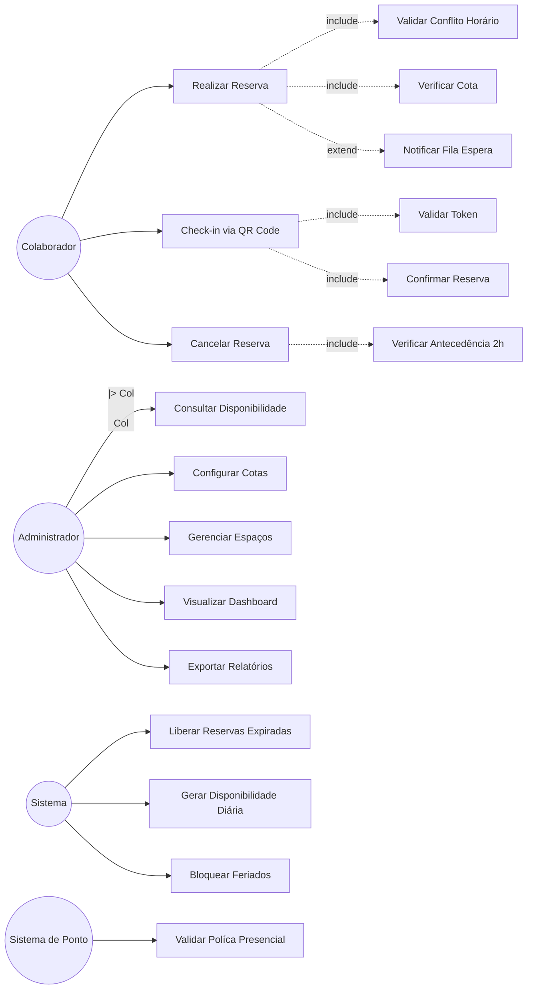

`Administrador` herda de `Colaborador`: o administrador é um colaborador especializado que, além de reservar e fazer check-in, também gerencia cotas, espaços, dashboards e relatórios. A seta de generalização (`Admin --|> Col`) indica que Administrador herda todos os casos de uso de Colaborador.

**Descrições dos casos de uso principais:**

- **UC02 Realizar Reserva**: Ator: Colaborador. Pré-condição: colaborador elegível (política de ponto), quota disponível, slots livres. Fluxo: seleciona workspace/dia/horário → sistema valida conflitos (UC03) e cota (UC04) → insere Booking com status PENDING → insere BookingWindow para cada slot → debita QuotaPeriod. Pós-condição: Booking PENDING, BookingWindow criado para cada slot, QuotaPeriod debitado, qr_token gerado para check-in (UC06).
- **UC01 Consultar Disponibilidade**: Ator: Colaborador. Pré-condição: autenticado. Fluxo: informa dia e filtros (andar/zona) → sistema retorna lista de slots livres por workspace via AvailabilityWindowRepository.get_by_day(). Pós-condição: lista exibida no front-end.
- **UC05 Notificar Fila de Espera**: Ator: Sistema (interno). Pré-condição: vaga liberada (cancelamento ou expiração) e Waitlist não vazia para o workspace+slot. Fluxo: pega próximo da fila FIFO → publica evento `WaitlistNotified` → SSE entrega push ao front-end → marca `notified_at` na Waitlist. Pós-condição: vaga disponível para o próximo da fila, com prazo de 5 min para confirmar.
- **UC14 Exportar Relatórios**: Ator: Administrador. Pré-condição: autenticado. Fluxo: seleciona tipo (utilização/custo) e período → `GenerateReportUseCase.execute` agrega dados de Booking/Workspace/CostCenter → exporta em CSV ou PDF. Pós-condição: download iniciado.
- **UC15 Liberar Reservas Expiradas**: Ator: Sistema (cron a cada 1 min). Pré-condição: existe Booking PENDING vencida (>10 min para estações, >15 min para salas de reunião). Fluxo: `ReleaseExpiredBookingsUseCase.execute` busca pendentes vencidas → move status para EXPIRED → libera slots (via DELETE em BookingWindow) → notifica waitlist (UC05). Pós-condição: vagas liberadas, waitlist notificada, quota não devolvida (no-show).
- **UC16 Gerar Disponibilidade Diária**: Ator: Sistema (cron diário às 00:00). Pré-condição: nenhum. Fluxo: `GenerateDailyAvailabilityUseCase.execute` para cada Workspace gera 40 AvailabilityWindows (08:00–18:00, grid 15min) com `seats = workspace.capacity`. Pós-condição: 40 janelas inseridas por workspace ativo.
- **UC17 Bloquear Feriados**: Ator: Administrador. Pré-condição: autenticado. Fluxo: cadastra Holiday com data e descrição → `BlockHolidaysUseCase.execute` remove AvailabilityWindows do dia (se existirem) → marca o dia como bloqueado. Pós-condição: nenhum slot disponível para reserva nesse dia.
- **UC18 Validar Política Presencial**: Ator: Sistema de Ponto (externo). Pré-condição: sincronização periódica. Fluxo: API REST envia registros de ponto → `SyncPointUseCase.execute` valida elegibilidade do colaborador para o dia (regra dos 3 dias presenciais) → atualiza `Employee.is_eligible_for_booking`. Pós-condição: Employee atualizado com política vigente.
- **UC06 Check-in via QR Code**: Ator: Colaborador. Pré-condição: reserva PENDING válida. Fluxo: leitura QR → validação token (UC07) → confirmação (UC08). Pós-condição: status CONFIRMED, intenção efetivada.
- **UC09 Cancelar Reserva**: Ator: Colaborador. Pré-condição: reserva CONFIRMED com >2h. Fluxo: verifica antecedência (UC10) → cancelamento devolve cota e libera janela. Pós-condição: status CANCELLED, quota liberada.
- **UC11 Configurar Cotas**: Ator: Administrador. Pré-condição: centro de custo existente. Fluxo: define quota mensal (horas-estação) para período. Pós-condição: QuotaPeriod criado/atualizado com total_hours definido.
- **UC12 Gerenciar Espaços**: Ator: Administrador. Pré-condição: nenhum. Fluxo: cadastra/edita/exclui workspaces (estações ou salas) com código, andar, zona e capacidade. Pós-condição: Workspace persistido e disponível para reserva.
- **UC13 Visualizar Dashboard**: Ator: Administrador. Pré-condição: autenticado. Fluxo: consulta agregações de ocupação por dia/andar/zona/departamento. Pós-condição: relatório de utilização exibido.

## 3. Diagrama de Classes

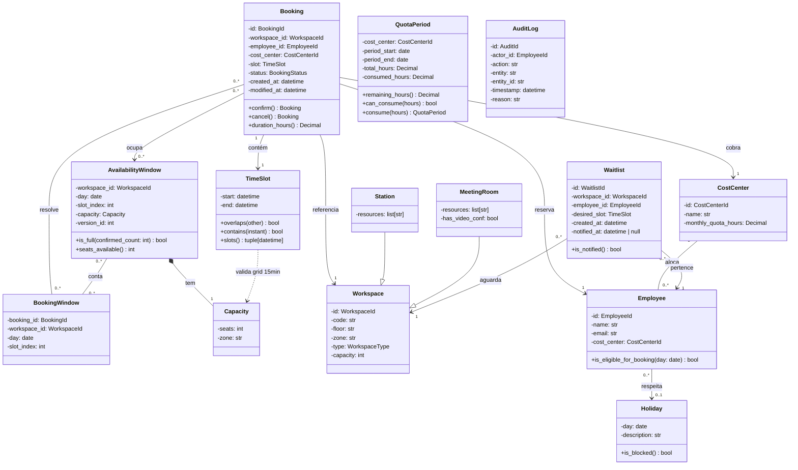

**Persistência:**

| Classe | Persistente? | Estratégia | Observação |
|--------|-------------|-----------|------------|
| Booking | Sim | Tabela `bookings`, PK id, FK workspace_id/employee_id/cost_center | Estado PENDING→CONFIRMED→CANCELLED, campos created_at e modified_at |
| AvailabilityWindow | Sim | Tabela `availability_windows`, PK (workspace_id, day, slot_index), version_id otimista | Imutável via replace() |
| QuotaPeriod | Sim | Tabela `quota_periods`, PK (cost_center, period_start) | Consumo monotonic |
| TimeSlot | Não (Value Object) | Coluna embutida em booking/availability_window | Range [start, end) |
| Capacity | Não (Value Object) | Coluna embutida em availability_window | seats + zone |
| Workspace | Sim | Tabela `workspaces`, PK id, coluna `type` discriminadora | Estação ou Sala |
| Station | Não (subclasse) | Colunas `code`, `floor`, `zone` na mesma tabela `workspaces` | Herança por tabela única |
| MeetingRoom | Não (subclasse) | Colunas `code`, `floor`, `zone` na mesma tabela `workspaces` | Herança por tabela única |
| CostCenter | Sim | Tabela `cost_centers`, PK id | Cotas mensais |
| BookingWindow | Sim | Tabela `booking_windows`, PK composta (booking_id, workspace_id, day, slot_index) | Resolução N-N Booking↔AvailabilityWindow |
| Employee | Sim | Tabela `employees`, PK id, FK cost_center_id | Funcionário que reserva |
| Holiday | Sim | Tabela `holidays`, PK day | Bloqueio de dias (feriados, pontos facultativos) |
| AuditLog | Sim | Tabela `audit_log`, PK id | Log de auditoria de alterações |
| Waitlist | Sim | Tabela `waitlist`, PK id, FK workspace_id, FK employee_id | Fila FIFO com timestamp |

**Estratégia de herança de Workspace:** tabela única com discriminador `type` (`estacao`/`sala`). Cada Station tem capacidade=1, recursos (monitor, tomada); cada MeetingRoom tem capacidade variada, recursos (projetor, videoconferência). Ambos compartilham a mesma lógica de reserva via AvailabilityWindow.

### 3.1 Diagrama Entidade-Relacionamento (DER)

**Tabela de conversão classe → tabela (apenas entidades persistentes):**

| Classe (Diagrama de Classes) | Cardinalidade (Classes) | Tabela (DER) | Cardinalidade (DER) | Mapeamento FK |
|------------------------------|------------------------|--------------|---------------------|---------------|
| Booking → Workspace | N-1 | BOOKING → WORKSPACE | `\|\|--o{` | `bookings.workspace_id → workspaces.id` |
| Booking → Employee | N-1 | BOOKING → EMPLOYEE | `\|\|--o{` | `bookings.employee_id → employees.id` |
| Booking → CostCenter | N-1 | BOOKING → COST_CENTER | `\|\|--o{` | `bookings.cost_center_id → cost_centers.id` |
| AvailabilityWindow → Workspace | N-1 | AVAILABILITY_WINDOW → WORKSPACE | `\|\|--o{` | `availability_windows.workspace_id → workspaces.id` |
| QuotaPeriod → CostCenter | N-1 | QUOTA_PERIOD → COST_CENTER | `\|\|--o{` | `quota_periods.cost_center_id → cost_centers.id` |
| Employee → CostCenter | N-1 | EMPLOYEE → COST_CENTER | `\|\|--o{` | `employees.cost_center_id → cost_centers.id` |
| Station --\|> Workspace | herança | Tabela única `workspaces` | coluna `type='estacao'` | — |
| MeetingRoom --\|> Workspace | herança | Tabela única `workspaces` | coluna `type='sala'` | — |
| Booking ↔ AvailabilityWindow | N-N | Tabela associativa `booking_windows` | PK composta + 2 FKs | `booking_windows.booking_id → bookings.id`, `booking_windows.(workspace_id, day, slot_index) → availability_windows` |
| Waitlist → Workspace | N-1 | WAITLIST → WORKSPACE | `\|\|--o{` | `waitlist.workspace_id → workspaces.id` |
| Waitlist → Employee | N-1 | WAITLIST → EMPLOYEE | `\|\|--o{` | `waitlist.employee_id → employees.id` |
| AuditLog → Employee (actor) | N-1 | AUDIT_LOG → EMPLOYEE | `\|\|--o{` | `audit_log.actor_id → employees.id` |
| Holiday | standalone | HOLIDAY | — | PK é `day` (sem FK) |

**Conferência de cardinalidades:** todas as relações do DER batem com a multiplicidade equivalente do diagrama de classes (seção 3). Não há divergência.

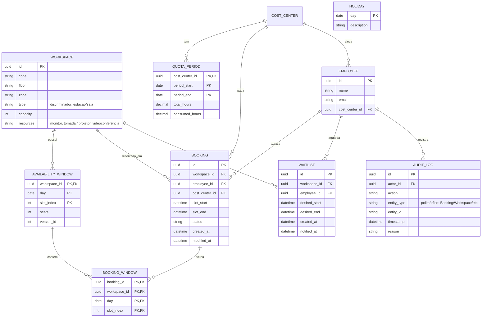

**Nota sobre N-N Booking↔AvailabilityWindow:** a relação é N-N porque uma reserva de 2h (8 slots de 15min) ocupa 8 AvailabilityWindows, e cada janela pode ter múltiplas reservas confirmadas (até `capacity.seats`). Modelada como tabela associativa `BOOKING_WINDOW` com PK composta (booking_id, workspace_id, day, slot_index) e UNIQUE constraint que materializa a checagem de capacidade — é onde o lock otimista atua.

**Nota sobre herança no DER:** Station e MeetingRoom compartilham a mesma tabela `workspaces` com discriminador `type`. O atributo `resources` armazena jsonb com recursos específicos por tipo. STATION sempre tem capacity=1; MEETING_ROOM tem capacity variável. Essa estratégia (tabela única com discriminador) foi escolhida conforme SKILL.md §3.1 default.

**Nota sobre `audit_log`:** `entity_id` é `string` (não FK) porque o log é polimórfico — pode referenciar Booking, Workspace, QuotaPeriod, Employee, etc. O discriminador é `entity_type`. `actor_id` é FK para `employees.id` (sempre um employee é o autor da ação). Se `actor_id` for NULL, indica ação do sistema (ex: `ReleaseExpiredBookingsUseCase` executado por cron).

## 4. Diagrama de Objetos

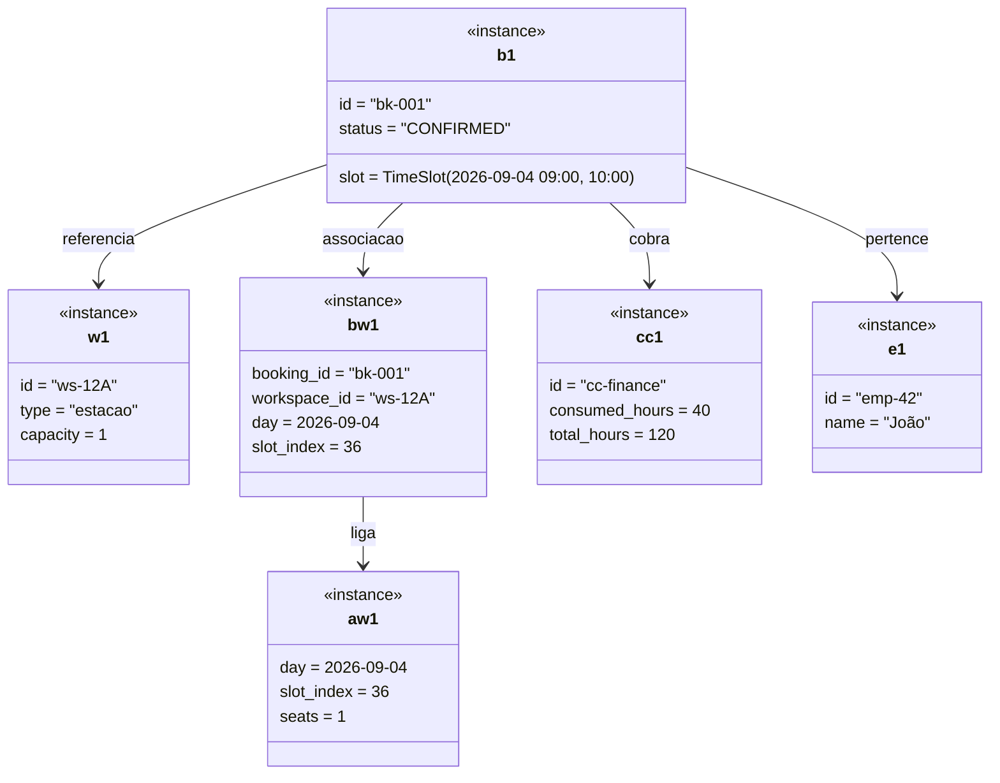

**Validação de cardinalidades:**
- `b1 → bw1 → aw1` valida a relação N-N Booking↔AvailabilityWindow via `BOOKING_WINDOW` (bk-001 ocupa aw1 através de bw1).
- `aw1.seats = 1` com `bw1` confirmando 1 reserva → janela cheia, qualquer reserva adicional lança `CapacityExceededError` (invariante I2).
- `b1.status = CONFIRMED` → `bw1` existe; se `b1` fosse `CANCELLED`, `bw1` não existiria (relação condicional ao estado).
- A antiga cardinalidade 1-N `AvailabilityWindow → Booking` foi substituída por N-N via tabela associativa, conforme DER §3.1.

## 5. Diagrama de Estados

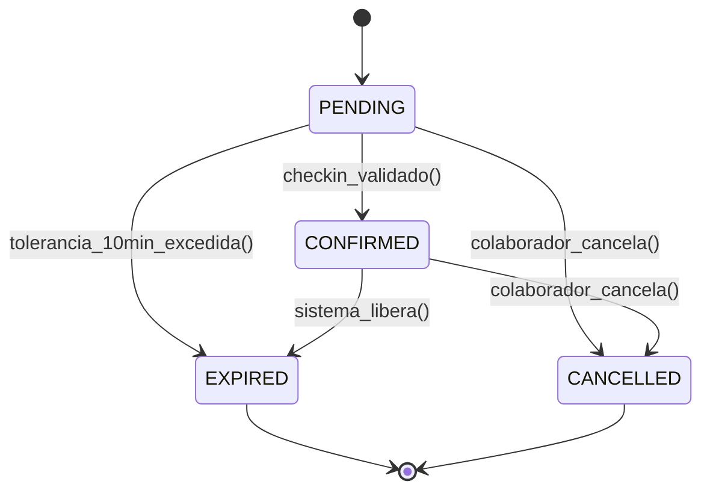

**Regras de transição:**
- `PENDING → CONFIRMED`: apenas após check-in QR Code válido (token 10min)
- `PENDING → EXPIRED`: sistema libera após 10min sem check-in (RO-01)
- `PENDING → CANCELLED`: colaborador cancela com >2h de antecedência (RO-03)
- `CONFIRMED → CANCELLED`: cancelamento com antecedência 2h; senão, considerado no-show tardio
- `CONFIRMED → EXPIRED`: sistema libera automaticamente após checkout do dia

## 6. Classes de Fronteira, Controle e Entidade (Boundary-Control-Entity)

### 6.1 Diagrama de Robustez — Realizar Reserva

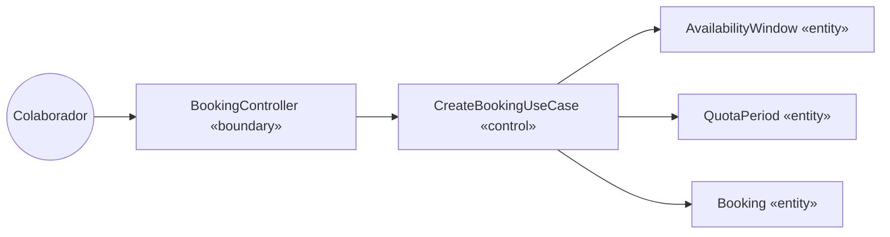

**Validação de cardinalidades no diagrama de robustez:**
- `Colaborador → BookingController`: 1 para 1 (um ator interage com uma tela)
- `BookingController → CreateBookingUseCase`: 1 para 1 (um caso de uso por UC)
- `CreateBookingUseCase → Booking/AvailabilityWindow/QuotaPeriod`: 1 para N (valida todos os slots da reserva)

### 6.2 Tabela de mapeamento BCE

| Caso de Uso | Boundary | Control (Use Case) | Entities |
|-------------|----------|-------------------|----------|
| Consultar Disponibilidade | AvailabilityController | QueryAvailabilityUseCase | AvailabilityWindow, Workspace |
| Realizar Reserva | BookingController | CreateBookingUseCase | Booking, AvailabilityWindow, QuotaPeriod, CostCenter |
| Check-in via QR Code | CheckInController | ConfirmBookingUseCase | Booking, AvailabilityWindow |
| Cancelar Reserva | BookingController | CancelBookingUseCase | Booking, AvailabilityWindow, QuotaPeriod |
| Notificar Fila de Espera (UC05) | — (interno) | NotifyWaitlistUseCase | Waitlist, Employee, Workspace |
| Configurar Cotas | AdminController | SetQuotaUseCase | QuotaPeriod, CostCenter |
| Gerenciar Espaços | AdminController | ManageWorkspaceUseCase | Workspace |
| Dashboard | ReportController | GenerateReportUseCase | Booking, Workspace, CostCenter |
| Liberar Reservas Expiradas (UC15) | — (cron) | ReleaseExpiredBookingsUseCase | Booking, AvailabilityWindow, Waitlist |
| Integração Ponto | IntegrationController | SyncPointUseCase | Employee, AuditLog |
| Bloquear Feriados (UC17) | AdminController | BlockHolidaysUseCase | Holiday |
| Gerar Disponibilidade Diária (UC16) | — (cron) | GenerateDailyAvailabilityUseCase | AvailabilityWindow, Holiday |

## 7. Diagrama de Sequência — Realizar Reserva

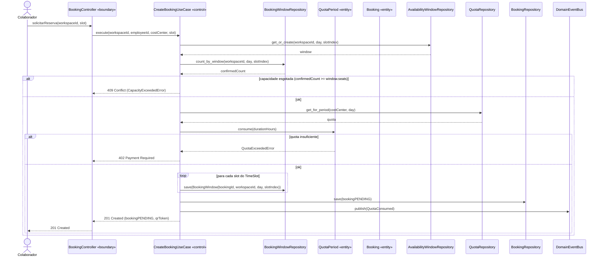

## 7.1 Diagrama de Sequência — Check-in via QR Code

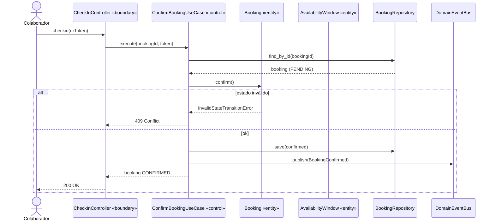

## 7.2 Diagrama de Sequência — Cancelar Reserva

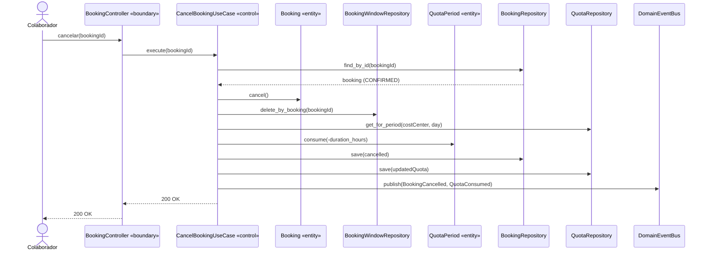

## 7.3 Diagrama de Sequência — Gerar Relatório

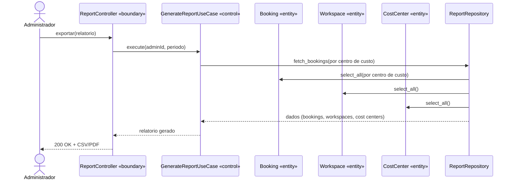

## 8. Diagrama de Atividades — Fluxo de Reserva

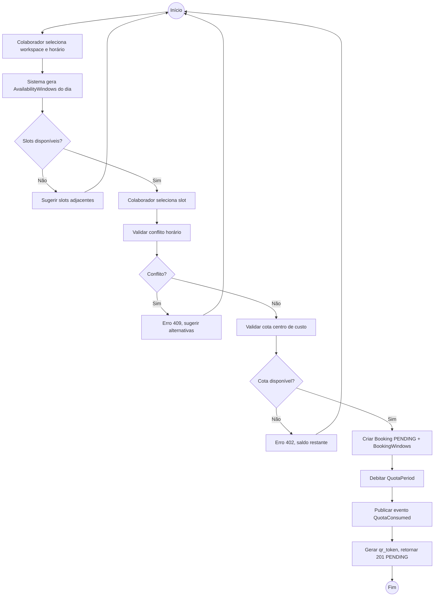

## 8.1 Diagrama de Atividades — Check-in via QR Code

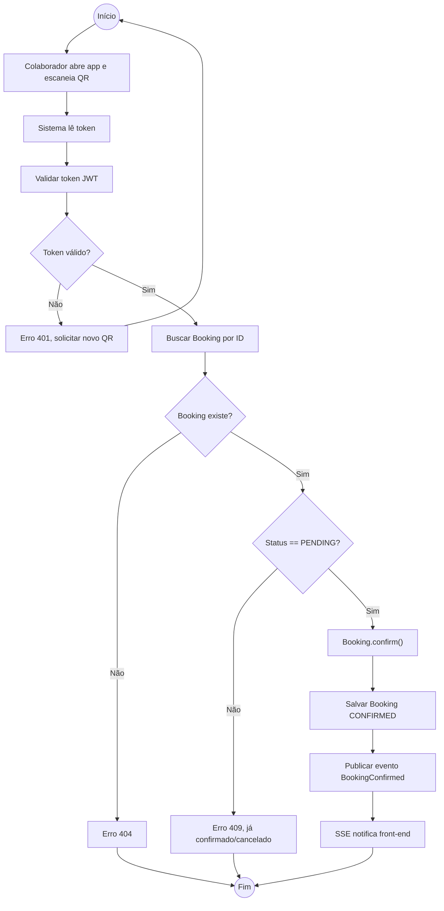

**Raias:** Raia Colaborador (A1) → Raia Sistema (A2..A11).

## 8.2 Diagrama de Atividades — Cancelar Reserva

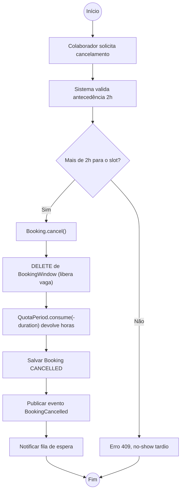

**Raias:** Raia Colaborador (A1) → Raia Sistema (A2..A9).

## 9. Diagrama de Componentes

```mermaid
flowchart TB
    subgraph Adapters["Interface Adapters"]
        BC[BookingController «boundary»]
        AIC[CheckInController «boundary»]
        AC[AdminController «boundary»]
        RC[ReportController «boundary»]
        IC[IntegrationController «boundary»]
        BR[BookingRepositoryPostgres «adapter»]
        AWR[AvailabilityWindowRepositoryPostgres «adapter»]
        QR[QuotaRepositoryPostgres «adapter»]
        WSR[WorkspaceRepositoryPostgres «adapter»]
        SSEPub[SsePublisher «adapter»]
    end
    subgraph Application["Application"]
        CBU[CreateBookingUseCase]
        CBUI[ConfirmBookingUseCase]
        CBU2[CancelBookingUseCase]
        REU[ReleaseExpiredBookingsUseCase «cron»]
        NW[NotifyWaitlistUseCase]
        SQ[SetQuotaUseCase]
        MW[ManageWorkspaceUseCase]
        GR[GenerateReportUseCase]
        SPU[SyncPointUseCase]
        BH[BlockHolidaysUseCase]
        GDA[GenerateDailyAvailabilityUseCase «cron»]
    end
    subgraph Domain["Domain"]
        BK[Booking «entity»]
        AW[AvailabilityWindow «entity»]
        QP[QuotaPeriod «entity»]
        WS[Workspace «entity»]
        WL[Waitlist «entity»]
        HL[Holiday «entity»]
        TS[TimeSlot «value»]
        CP[Capacity «value»]
        BRif[[BookingRepository «interface»]]
        AWRif[[AvailabilityWindowRepository «interface»]]
        QRif[[QuotaRepository «interface»]]
        WSRif[[WorkspaceRepository «interface»]]
        WLif[[WaitlistRepository «interface»]]
    end
    subgraph Infra["Frameworks & Drivers"]
        DB[(PostgreSQL)]
        Web[FastAPI]
        SSEServer[SSE Stream]
        QRGen[QR Code Generator]
        Cron[Scheduler / APScheduler]
        PointExt[Sistema de Ponto Externo]
    end

    Web --> BC
    Web --> AIC
    Web --> AC
    Web --> RC
    Web --> IC
    BC --> CBU
    AIC --> CBUI
    AC --> SQ
    AC --> MW
    AC --> BH
    RC --> GR
    IC --> SPU
    Cron --> REU
    Cron --> GDA
    CBU --> BK
    CBU --> AW
    CBU --> QP
    CBU --> BRif
    CBU --> AWRif
    CBU --> QRif
    CBUI --> BK
    CBUI --> AW
    CBU2 --> BK
    CBU2 --> AW
    CBU2 --> QP
    REU --> AW
    REU --> BK
    REU --> NW
    NW --> WL
    NW --> WLif
    SQ --> QP
    SQ --> QRif
    MW --> WS
    MW --> WSRif
    GR --> BRif
    GR --> WSRif
    GR --> QRif
    SPU --> BK
    SPU --> ALRif[[AuditLogRepository «interface»]]
    BH --> HL
    BH --> AWRif
    GDA --> AWRif
    GDA --> HL
    BRif -.implementa.-> BR
    AWRif -.implementa.-> AWR
    QRif -.implementa.-> QR
    WSRif -.implementa.-> WSR
    WLif -.implementa.-> WLR[WaitlistRepositoryPostgres «adapter»]
    ALRif -.implementa.-> ALR[AuditLogRepositoryPostgres «adapter»]
    BR --> DB
    AWR --> DB
    QR --> DB
    WSR --> DB
    WLR --> DB
    ALR --> DB
    CBU --> SSEPub
    CBUI --> SSEPub
    CBU2 --> SSEPub
    REU --> SSEPub
    NW --> SSEPub
    SSEPub --> SSEServer
    AIC --> QRGen
    SPU --> PointExt
```

**Nota sobre dependências de `GenerateReportUseCase`:** o use case de relatório não depende de entidades de domínio (Booking, Workspace) diretamente — depende das interfaces de repository (`BRif`, `WSRif`, `QRif`) para manter a regra de dependência (use case não conhece implementação). Os dados fluem dos repositories para o use case, nunca o inverso.

## 10. Implementação: DDD, Clean Architecture, TDD

### DDD (Domain-Driven Design)

**Aggregates e Aggregate Roots:**

| Aggregate Root | Entities internas | Value Objects | Repository |
|----------------|-------------------|---------------|------------|
| Booking | (ref) AvailabilityWindow | TimeSlot, Capacity | BookingRepository |
| AvailabilityWindow | (ref) Booking via BookingWindow | Capacity, SlotIndex | AvailabilityWindowRepository |
| QuotaPeriod | — | — | QuotaRepository |
| Workspace | — | — | WorkspaceRepository |
| Employee | — | — | EmployeeRepository |
| AuditLog | — | — | AuditLogRepository |
| Waitlist | — | — | WaitlistRepository |

**Regras de consistência entre agregados:**
- `Booking` referencia `AvailabilityWindow` apenas pelo ID; nunca carrega a janela inteira em memória.
- A relação N-N é mantida pelo `BookingWindow` (junção) — entidade interna de `Booking` aggregate, atualizada transacionalmente.
- `AvailabilityWindow` é aggregate root **independente** porque tem version_id otimista próprio (lock otimista por `version_id` na projection materializada). Outros aggregates só referenciam pelo ID.
- `QuotaPeriod` é independente; `Booking` apenas o referencia e chama `consume()` atomicamente (via use case, transação de banco).
- `Employee` é independente; `Booking` o referencia por ID.
- `AuditLog` é append-only; escrito por todos os use cases via event handler (não transacional com a operação principal).

**Domain Events (EventBus):**

| Evento | Publishido por | Consumido por |
|--------|--------------|---------------|
| `BookingConfirmed` | CreateBookingUseCase, ConfirmBookingUseCase | SSE Publisher, AuditLogHandler |
| `BookingCancelled` | CancelBookingUseCase | SSE Publisher, AuditLogHandler, WaitlistHandler |
| `BookingExpired` | ReleaseExpiredBookingsUseCase | SSE Publisher, AuditLogHandler, WaitlistHandler |
| `QuotaConsumed` | CreateBookingUseCase | AuditLogHandler, QuotaAlertHandler |
| `QuotaAlert` | QuotaAlertHandler | SSE Publisher, NotificationService (e-mail/Slack) |
| `WaitlistNotified` | NotifyWaitlistUseCase | SSE Publisher |
| `AvailabilityReleased` | ReleaseExpiredBookingsUseCase | SSE Publisher |

**Invariantes do domínio (do deskflow_ideacao_arquitetura.md):**

| # | Invariante | Garantida por |
|---|------------|---------------|
| I1 | Toda reserva ocupa slot alinhado em grid 15min | `TimeSlot.__post_init__` |
| I2 | AvailabilityWindow nunca excede capacity.seats | `BookingWindowRepository.count_by_window()` (UNIQUE constraint em `booking_windows`) |
| I3 | QuotaPeriod.consumed_hours nunca excede total_hours | `QuotaPeriod.consume` |
| I4 | Transições unidirecionais: PENDING→CONFIRMED ou PENDING→CANCELLED | `Booking.confirm/cancel` |
| I5 | Confirmação e consumo de quota atômicos | `BookingService.confirm_with_quota` |
| I6 | Nenhuma sobreposição de reservas confirmadas no mesmo workspace | `BookingWindowRepository.count_by_window()` verificado antes de cada `INSERT` na junction table |

### Clean Architecture (camadas)

```
src/
  domain/
    entities/
      booking.py              # Booking, BookingStatus
      availability_window.py   # AvailabilityWindow
      quota_period.py          # QuotaPeriod
      workspace.py             # Workspace
      waitlist.py             # Waitlist aggregate root
      employee.py             # Employee
      audit_log.py           # AuditLog
    value_objects/
      time_slot.py             # TimeSlot, overlaps()
      capacity.py              # Capacity
    repositories/
      booking_repository.py    # interface
      availability_window_repo.py # interface
      quota_repository.py      # interface
      workspace_repository.py  # interface
      employee_repository.py   # interface
      audit_log_repository.py  # interface
      waitlist_repository.py   # interface
    events/
      domain_events.py         # BookingConfirmed, etc.
    exceptions/
      domain_errors.py         # CapacityExceededError, etc.
  application/
    use_cases/
      create_booking.py        # CreateBookingUseCase
      confirm_booking.py       # ConfirmBookingUseCase (check-in)
      cancel_booking.py        # CancelBookingUseCase
      release_expired.py       # ReleaseExpiredBookingsUseCase (cron)
      set_quota.py             # SetQuotaUseCase
      manage_workspace.py      # ManageWorkspaceUseCase
      generate_report.py       # GenerateReportUseCase
    services/
      booking_service.py       # orquestra invariantes I1-I6
  adapters/
    controllers/
      booking_controller.py    # REST boundary
      checkin_controller.py    # REST boundary QR
      admin_controller.py      # REST boundary admin
      report_controller.py     # REST boundary relatórios
    repositories/
      booking_repo_postgres.py
      availability_window_repo_postgres.py
      quota_repo_postgres.py
      workspace_repo_postgres.py
      waitlist_repo_postgres.py
    events/
      sse_publisher.py         # DomainEvent → SSE stream
      audit_log_handler.py     # AuditLogHandler (append-only)
      quota_alert_handler.py   # QuotaAlertHandler (publica QuotaAlert aos 80%/95%)
      waitlist_handler.py     # WaitlistHandler (publica WaitlistNotified)
  infra/
    database.py                # SQLAlchemy 2.0 session
    migrations/                # Alembic
    security.py                # JWT/OAuth2
    qr_generator.py            # QR Code
```

**Regra de dependência:** Domain → Application → Adapters → Infra. Nenhuma lib de infra dentro de domain/application.

### TDD (Test-Driven Development)

**Pirâmide de testes:**

| Camada | Ferramenta | Escopo | Quantidade |
|--------|-----------|--------|------------|
| Domain | pytest + dataclasses frozen | Invariantes I1-I6, Value Objects | Muitos |
| Application | pytest + fake repository | Use cases, orquestração de agregados | Médio |
| Adapter | pytest + TestClient (FastAPI) | Controller HTTP, serialização | Poucos |
| Integration | pytest + PostgreSQL test | Repository real, migrações | Mínimo |

**Ordem de implementação (red→green→refactor):**

1. **Sprint 1 — Fundação do Domínio:**
   - Teste: `TimeSlot.overlaps()` → falha → implementa dataclass frozen
   - Teste: `BookingWindowRepository.count_by_window()` retorna `seats` → `INSERT` em `booking_windows` viola UNIQUE → `CapacityExceededError`
   - Teste: `QuotaPeriod.consume()` excede → falha → implementa
   - Teste: `Booking.confirm()` state transition → falha → implementa
   - Rastreabilidade: RF01, RF02, RF11 → I1, I2, I3, I4

2. **Sprint 2 — Motor de Agendamento:**
   - Teste: `CreateBookingUseCase.execute()` capacity full → 409
   - Teste: `CreateBookingUseCase.execute()` quota exceeded → 402
   - Teste: `ConfirmBookingUseCase.execute()` invalid token → erro
   - Teste: `ReleaseExpiredBookingsUseCase.execute()` move PENDING→EXPIRED e notifica waitlist
   - Rastreabilidade: RF01, RF02, RF03, RF04, RF11 → UC02, UC06, UC15, UC05

3. **Sprint 3 — Frontend e Relatórios:**
   - Teste: `GenerateReportUseCase.execute()` CSV/PDF output
   - Teste: Controller endpoints retornam 200/400/409/402
   - Teste: SSE stream notifica disponibilidade atualizada
   - Rastreabilidade: RF07, RF09, RF10 → UC13, UC14

**Critério de aceitação:** Cada RF tem pelo menos 1 teste que comprove a regra de domínio + 1 teste de integration que prove a rastreabilidade RF→caso de uso→teste.

## 11. Glossário e Rastreabilidade Cruzada

### 11.1 Glossário de Termos de Domínio

| Termo | Definição | Contexto no Domínio |
|-------|-----------|---------------------|
| Booking | Reserva de workspace em um slot de tempo | Aggregate root, entidade principal |
| AvailabilityWindow | Janela de disponibilidade de 15min para um workspace | Aggregate root, projeção materializada, imutável |
| QuotaPeriod | Cota mensal de horas-estação por centro de custo | Aggregate root, valor monotônico |
| BookingWindow | Registro da relação N-N entre Booking e AvailabilityWindow | Entidade de junção, PK composta, atualizada pelo use case |
| TimeSlot | Intervalo de tempo alinhado a grid de 15min | Value Object, imutável |
| Capacity | Limite de assentos por janela | Value Object |
| Workspace | Espaço físico (estação ou sala) que pode ser reservado | Aggregate root |
| CostCenter | Centro de custo que paga pelo uso de workspaces | Aggregate root |
| Employee | Colaborador que realiza reservas | Aggregate root |
| Waitlist | Fila de espera FIFO por vaga liberada | Entidade com prioridade timestamp, notifica quando vaga surge |
| Holiday | Feriado ou ponto facultativo bloqueado | Entity, impede geração de AvailabilityWindow |
| Check-in | Ato de validar presença via QR Code | Transição de estado PENDING→CONFIRMED |
| No-show | Reserva sem check-in após tolerância | Transição PENDING→EXPIRED |
| AuditLog | Registro append-only de alterações de reserva | Entity, escrito por event handlers, não transacional com operação principal |

### 11.2 Matriz de Rastreabilidade RF → UC → Teste

| RF | UC | Teste de Domínio | Teste de Use Case | Teste de Integração |
|----|----|-----------------|--------------------|--------------------|
| RF01 | UC02 | `TimeSlot.__post_init__` rejeita slot inválido | `CreateBookingUseCase.execute` cria booking válido | `POST /api/bookings` retorna 201 |
| RF02 | UC06 | `Booking.confirm()` valida PENDING | `ConfirmBookingUseCase.execute` valida token | `POST /api/checkin` retorna 200 |
| RF03 | UC15 | — | `ReleaseExpiredBookingsUseCase.execute` move PENDING→EXPIRED | Job cron executa a cada 1min |
| RF04 | UC05 | — | `NotifyWaitlistUseCase.execute` publica evento | SSE entrega notificação ao cliente |
| RF05 | UC11 | `QuotaPeriod.consume` decrementa | `SetQuotaUseCase.execute` cria quota mensal | `PUT /api/admin/quotas` retorna 200 |
| RF06 | UC12 | `Workspace.__post_init__` valida capacidade | `ManageWorkspaceUseCase.execute` CRUD | `POST /api/admin/workspaces` retorna 201 |
| RF07 | UC13 | — | `GenerateReportUseCase.execute` agrega | `GET /api/reports/utilization` retorna JSON |
| RF08 | UC18 | `Employee.is_eligible_for_booking(day)` valida elegibilidade | `SyncPointUseCase.execute` sincroniza dados de ponto | Cliente REST externo recebe chamada |
| RF09 | UC14 | — | `GenerateReportUseCase.export_csv/pdf` | Download de arquivo válido |
| RF10 | UC14 | — | `GenerateReportUseCase.export_csv/pdf` | Download de arquivo válido |
| RF11 | UC09 | `Booking.cancel` valida antecedência 2h | `CancelBookingUseCase.execute` valida regra | `DELETE /api/bookings/:id` retorna 200/409 |
| RF12 | UC02/UC06/UC09 | `Booking` registra `created_at`, `modified_at` | Todos os use cases publicam eventos de auditoria | Log gravado em `audit_log` table |
| RF13 | UC16 | `AvailabilityWindow.slots()` gera 40 slots/dia | `GenerateDailyAvailabilityUseCase.execute` | Postgres tem 40 rows/dia por workspace |
| RF14 | UC17 | `Holiday.is_blocked()` retorna true | `BlockHolidaysUseCase.execute` | Janela do feriado indisponível |
| RF15 | UC11 | `QuotaPeriod.consumed_hours` atingindo 80% | Handler `QuotaAlertHandler` publica alerta e-mail/Slack via `SsePublisher` (AuditLogRepository apenas registra) | E-mail/Slack enviado quando `QuotaAlertEvent` é publicado |

### 11.3 Matriz de Rastreabilidade UC → Entity → Diagrama

| UC | Entities | Diagrama de Classes | DER | Sequência | Atividades | Robustez |
|----|----------|---------------------|-----|-----------|------------|----------|
| UC01 | AvailabilityWindow, Workspace | §3 | §3.1 | — | — | — |
| UC02 | Booking, AvailabilityWindow, QuotaPeriod, CostCenter | §3 | §3.1 | §7 | §8 | §6.1 |
| UC03 | AvailabilityWindow (read-only) | §3 | §3.1 | (interno a UC02 §7) | — | — |
| UC04 | QuotaPeriod (read-only) | §3 | §3.1 | (interno a UC02 §7) | — | — |
| UC05 | Waitlist, Employee, Workspace | §3 | §3.1 | (interno a UC15/UC09) | — | — |
| UC06 | Booking, AvailabilityWindow | §3 | §3.1 | §7.1 | §8.1 | — |
| UC07 | Booking (read-only) | §3 | §3.1 | (interno a UC06 §7.1) | — | — |
| UC08 | Booking | §3 | §3.1 | (interno a UC06 §7.1) | — | — |
| UC09 | Booking, AvailabilityWindow, QuotaPeriod | §3 | §3.1 | §7.2 | §8.2 | — |
| UC10 | Booking, TimeSlot (read-only) | §3 | §3.1 | (interno a UC09 §7.2) | — | — |
| UC11 | QuotaPeriod, CostCenter | §3 | §3.1 | — | — | — |
| UC12 | Workspace | §3 | §3.1 | — | — | — |
| UC13 | Booking, Workspace, CostCenter | §3 | §3.1 | §7.3 | — | — |
| UC14 | Booking, Workspace, CostCenter | §3 | §3.1 | (subset de UC13 §7.3) | — | — |
| UC15 | Booking, AvailabilityWindow, Waitlist | §3, §5 | §3.1 | — | — | — |
| UC16 | AvailabilityWindow, Holiday | §3 | §3.1 | — | — | — |
| UC17 | Holiday, AvailabilityWindow | §3 | §3.1 | — | — | — |
| UC18 | Employee, AuditLog | §3 | §3.1 | — | — | — |

## Checklist final do documento

- [x] 1. Requisitos funcionais e não funcionais (tabela RF01-RF15, RNF01-RNF07)
- [x] 2. Diagrama de casos de uso com atores, include, extend
- [x] 3. Descrição textual dos casos de uso principais (pré/pós-condição, fluxos)
- [x] 4. Diagrama de classes com composição, agregação, herança e multiplicidades
- [x] 5. Marcação de persistência das entidades
- [x] 6. Diagrama entidade-relacionamento (DER)
- [x] 7. Diagrama de objetos (instância) validando cardinalidades/relações
- [x] 8. Diagrama de estados (Booking: PENDING→CONFIRMED→CANCELLED/EXPIRED)
- [x] 9. Classes de fronteira/controle/entidade mapeadas por caso de uso
- [x] 10. Diagrama de sequência dos casos de uso principais
- [x] 11. Diagrama de atividades para fluxos principais
- [x] 12. Diagrama de componentes (camadas Clean Architecture)
- [x] 13. Mapeamento DDD (aggregates, entidades, value objects, repositories)
- [x] 14. Estrutura de camadas Clean Architecture (domain/application/adapters/infra)
- [x] 15. Plano de testes TDD por caso de uso (unidade domínio → use case → integração)
- [x] 16. Glossário de termos de domínio
- [x] 17. Matriz de rastreabilidade RF → UC → teste
- [x] 18. Matriz de rastreabilidade UC → entity → diagrama

**Rastreabilidade final:**
- RF01-RF15 → UC01-UC18 (seção 2) → testes TDD (seção 10)
- Cada entity do DER (seção 3.1) tem teste de invariante (I1-I6)
- Cada use case (seção 6) tem diagrama de sequência (seção 7)
- Cada aggregate root (seção 10 DDD) tem repository interface + implementação
- Cada UC da BCE (seção 6) tem diagrama de robustez e de sequência correspondentes
- Componentes do diagrama (seção 9) correspondem a controllers e repositories da BCE e da estrutura de camadas (seção 10)
